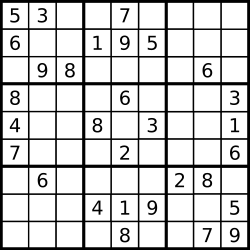

Arrays & Hashing

# 217. Contains Duplicate

## 题目
Given an integer array nums, return true if any value appears at least twice in the array, and return false if every element is distinct.

Input: nums = [1,2,3,1]
Output: true
Explanation:
The element 1 occurs at the indices 0 and 3.

Input: nums = [1,2,3,4]
Output: false
Explanation:
All elements are distinct.

## Code
```python
class Solution:
    def containsDuplicate(self, nums: List[int]) -> bool:
        hashset = set()
        for i in nums:
            if i in hashset:
                return True
            hashset.add(i)
        return False
```
## 思路
- 建立一个set，set只能存储一个元素一次，用.add()添加元素

## 复杂度
Time Complexity: O(n)
Space Complexity: O(n)


# 242. Valid Anagram 变位词
## 题目
Given two strings s and t, return true if t is an anagram of s, and false otherwise.

Input: s = "anagram", t = "nagaram"
Output: true

Input: s = "rat", t = "car"
Output: false

## 思路
- 先比较长度
- 用hashmap, 本质上是字典, key:value对, 比较两个hashmap是否完全相同
- Counter[key] -> value
- for loop字典, loop出的是key
- 字典记得: 用.get(key, 0): -> 取key的value, 如果没出现过取0

OR

- 比较sorted()后的字符是否一模一样

## Solution 1
### Code 1
``` python
    class Solution:
    def isAnagram(self, s: str, t: str) -> bool:
        CounterS, CounterT = {}, {}
        if len(s) != len(t):
            return False
        for c in range(len(s)):
            CounterS[s[c]] = 1 + CounterS.get(s[c], 0)
            CounterT[t[c]] = 1 + CounterT.get(t[c], 0)
        for n in CounterS:
            if CounterS[n] != CounterT.get(n, 0):
                return False
        return True
```
``` python
    class Solution:
    def isAnagram(self, s: str, t: str) -> bool:
        return Counter(s) == Counter(t)
```
### Complexity 1
time: O(s+t)
space: O(s+t)

## Solution 2
### Code 2
```python
    class Solution:
    def isAnagram(self, s: str, t: str) -> bool:
        return sorted(s) == sorted(t)
```
### Complexity 2
time: O(nlogn) OR O(n^2)
space: O(1) OR O(n) depends on the sorting algorithm

# 1. Two Sum
## 题目
Given an array of integers nums and an integer target, return indices of the two numbers such that they add up to target.
You may assume that each input would have exactly one solution, and you may not use the same element twice.
You can return the answer in any order.

Input: nums = [2,7,11,15], target = 9
Output: [0,1]
Explanation: Because nums[0] + nums[1] == 9, we return [0, 1].

Input: nums = [3,2,4], target = 6
Output: [1,2]

## 思路
- for i,v in enumerate(nums) -> enumerate()的结果先是index, 再是value. 但是hashmap是value:index
- 用hashmap储存value:index
- diff = target - v
- 如果diff在hashmap里(ie 之前出现过), 就return v和diff的indices

## Code
```python
    class Solution:
    def twoSum(self, nums: List[int], target: int) -> List[int]:
        PrevMap = {} # val : index
        for i, v in enumerate(nums):
            diff = target - v
            if diff in PrevMap:
                return [PrevMap[diff], i]
            PrevMap[v] = i
```
## Complexity
time:O(n)
space:O(n)

# 49. Group Anagram
## 题目
Given an array of strings strs, group the anagrams together. You can return the answer in any order.

input: strs = ["eat","tea","tan","ate","nat","bat"]

Output: [["bat"],["nat","tan"],["ate","eat","tea"]]

Explanation:

There is no string in strs that can be rearranged to form "bat".
The strings "nat" and "tan" are anagrams as they can be rearranged to form each other.
The strings "ate", "eat", and "tea" are anagrams as they can be rearranged to form each other.

## 思路
- defaultdict(list)创建key:list对, 当key不存在时自动创建空list绑定key
- 用hashmap, key是list of count of all characters(from a to z), 但是python不能用list做key, 所以要改为tuple
- count作为每个词的list, index: ASCII码(距离"a"的), value: 出现次数
- hashmap[key].append(value)用于已经有value时
- hashmap[key] = value用于还没有value时
- list(hashmap.values())把values以list形式return

## Code
```python
class Solution:
    def groupAnagrams(self, strs: List[str]) -> List[List[str]]:
        res = defaultdict(list)
        for s in strs:
            count = [0] * 26
            for c in s:
                count[ord(c) - ord("a")] += 1
            res[tuple(count)].append(s)
        return list(res.values())
```

## Complexity
Time: O(m*n)
Space: O(m*n)

# 347. Top K Frequent Elements
## 题目
Given an integer array nums and an integer k, return the k most frequent elements. You may return the answer in any order.

Input: nums = [1,1,1,2,2,3], k = 2
Output: [1,2]

Input: nums = [1], k = 1
Output: [1]

## 思路
- bucket sort -> Count : Value而不是Value : Count
  因为array的范围不是bounded, 用Value作为key会使Hashmap无限大
  但是用Count做key的最大值就是len(strs)
- hashmap vs bucket sort
  hashmap没有排序, 还需要把value排序, 导致O(nlogn)的time complexity
  bucket sort已经排序完了, O(n)的time complexity
- Count.items()返回key:value对 (对dict用)
  enumerate(list)返回index:value对 (对list用)
- Count作为hashmap, 存储char:frequency
  Freq作为bucket sort, 存储sorted的frequency
- freq[c].append(n) | bucket sort的initialisation, 指定了index
  res.append(n) | 最终答案
- dict.get(n, 0) | n为index, 0为找不到时的return value
- range(a,b,c) 包含a, 不包含b, c为步长

## Code
```python
class Solution:
    def topKFrequent(self, nums: List[int], k: int) -> List[int]:
        count = {} #hashmap
        freq = [[] for i in range(len(nums) + 1)] #index:Count, value:value

        for n in nums:
            count[n] = 1 + count.get(n, 0) #initialise hashmap
        for n, c in count.items():
            freq[c].append(n) #initialise freq array
        
        res = []
        for i in range(len(freq) - 1, 0, -1): #freq array: index从0到len(freq)-1
            for n in freq[i]:#freq array的value是list
                res.append(n)
                if len(res) == k:
                    return res
```

## Complexity
Time: O(n)
Space: O(n)

# Encode and Decode Strings
## 题目
Design an algorithm to encode a list of strings to a string. The encoded string is then sent over the network and is decoded back to the original list of strings.

Example 1:
Input: strs = ["Hello","World"]
Output: ["Hello","World"]

Explanation:
// Machine 1 ---encoded_string---> Machine 2

## 思路
- 用<special delimiter><length><word>的格式
- word里可能出现任何delimiter, 所以要有length确定下一个delimiter出现的位置
- str用+=append新的str

## Code
```python
class Solution:
    def encode(self, strs: List[str]) -> str: #list to string
        res = ""
        for s in strs: 
            res += str(len(s)) + '#' + s
        return res

    def decode(self, s: str) -> List[str]: #string to list
        res,i = [], 0
        while i < len(s): #i为length起始位置, j为delimiter位置; 要increment i所以用while loop
            j = i
            while s[j] != '#':
                j += 1
            length = int(s[i : j])
            res.append(s[j+1 : j+length+1])
            i = j + length + 1
        return res
```
## Complexity
time: O(n)
space: O(1)


# 238. Product of Array Except Self
## 题目
Given an integer array nums, return an array answer such that answer[i] is equal to the product of all the elements of nums except nums[i].
The product of any prefix or suffix of nums is guaranteed to fit in a 32-bit integer.
You must write an algorithm that runs in O(n) time and without using the division operation.

Example 1:
Input: nums = [1,2,3,4]
Output: [24,12,8,6]

Example 2:
Input: nums = [-1,1,0,-3,3]
Output: [0,0,9,0,0]

## 思路
- [2*3*4, 1*3*4, 1*2*4, 1*2*3]
  用prefix和postfix两个array, 但是会有O(n)的space complexity, 于是用res两次扫完
- res先initialise因为要进行乘法运算
- why先res[i]再更新prefix: prefix代表该index前面的乘积, 该index的prefix要是前一次的结果
- range(len(nums)-1, -1, -1) range()函数左闭右开

## Code
```python
class Solution:
    def productExceptSelf(self, nums: List[int]) -> List[int]:
        res = [1] * len(nums)
        prefix, postfix = 1, 1
        for i in range(len(nums)):
            res[i] *= prefix
            prefix *= nums[i]
        for i in range(len(nums)-1, -1, -1):
            res[i] *= postfix
            postfix *= nums[i]
        return res
```

## Complexity
Time: O(n)
Space: O(1)

# 36. Valid Sudoku
## 题目
Determine if a 9 x 9 Sudoku board is valid. Only the filled cells need to be validated according to the following rules:

Each row must contain the digits 1-9 without repetition.
Each column must contain the digits 1-9 without repetition.
Each of the nine 3 x 3 sub-boxes of the grid must contain the digits 1-9 without repetition.
Note:

A Sudoku board (partially filled) could be valid but is not necessarily solvable.
Only the filled cells need to be validated according to the mentioned rules.



Input: board = 
[["5","3",".",".","7",".",".",".","."]
,["6",".",".","1","9","5",".",".","."]
,[".","9","8",".",".",".",".","6","."]
,["8",".",".",".","6",".",".",".","3"]
,["4",".",".","8",".","3",".",".","1"]
,["7",".",".",".","2",".",".",".","6"]
,[".","6",".",".",".",".","2","8","."]
,[".",".",".","4","1","9",".",".","5"]
,[".",".",".",".","8",".",".","7","9"]]
Output: true
Example 2:

Input: board = 
[["8","3",".",".","7",".",".",".","."]
,["6",".",".","1","9","5",".",".","."]
,[".","9","8",".",".",".",".","6","."]
,["8",".",".",".","6",".",".",".","3"]
,["4",".",".","8",".","3",".",".","1"]
,["7",".",".",".","2",".",".",".","6"]
,[".","6",".",".",".",".","2","8","."]
,[".",".",".","4","1","9",".",".","5"]
,[".",".",".",".","8",".",".","7","9"]]
Output: false
Explanation: Same as Example 1, except with the 5 in the top left corner being modified to 8. Since there are two 8's in the top left 3x3 sub-box, it is invalid.

## 思路
- 用hashset检查是否重复, 遍历row和colunm满足(1)和(2)
- 把'9*9'拆分成'3*3', 用DIV向下取整
- hashset的key:(row,column) | hashset的value:该坐标的数
- 往set里加入数据用 squares[r//3, c//3].add(board[r][c])
- /的结果是浮点数, //的结果是向下取整
- rows = collection.defaultdict(set)创建dict类型, 当数据不存在时加入set(set作为value, key为任意值)中, collection为import的库, 可以省略
- square的key是tuple, (r,c)

## Code
```python
class Solution:
    def isValidSudoku(self, board: List[List[str]]) -> bool:
        rows = defaultdict(set)
        cols = defaultdict(set)
        squares = defaultdict(set) # key: (r//3, c//3)
        for r in range(9):
            for c in range(9):
                if board[r][c] == '.': # skip if empty
                    continue
                if (board[r][c] in rows[r] or # already in rows
                   board[r][c] in cols[c] or # already in columns
                   board[r][c] in squares[r//3, c//3]): # already in 3*3 square
                   return False
                rows[r].add(board[r][c]) # update hashset
                cols[c].add(board[r][c])
                squares[r//3, c//3].add(board[r][c])
        return True
```

## Complexity
Time: O(1)
Space: O(1) 因为给定了sudoku大小为9*9